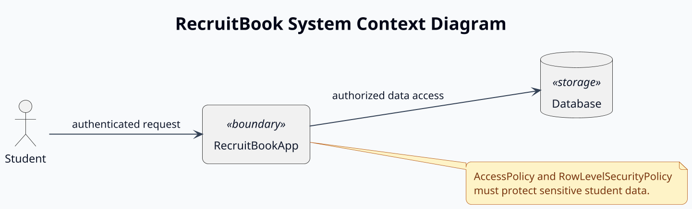

# RecruitBook PlantUML Style Guide

This file defines the required PlantUML styling rules for every RecruitBook diagram.

Use this file together with:

* `context/diagram_rules.md`
* `context/security_rules.md`
* `context/recruitbook_object_catalog.md`
* `context/recruitbook_relationship_catalog.md`
* `context/recruitbook_method_catalog.md`
* `context/use_case_summary.md`

---

# 1. Style Guide Purpose

The purpose of this file is to keep every RecruitBook `.puml` diagram visually consistent.

This applies to:

| Diagram Type                       | Applies? |
| ---------------------------------- | -------- |
| System Context Diagram             | Yes      |
| Use Case Diagram                   | Yes      |
| Misuse Case Diagram                | Yes      |
| Secure Domain Class Diagram        | Yes      |
| Activity Diagrams                  | Yes      |
| Sequence Diagrams                  | Yes      |
| State Machine Diagrams             | Yes      |
| Trust Boundary / Data Flow Diagram | Yes      |
| Component / Deployment Diagram     | Yes      |

---

# 2. Mandatory Rule

> **Every `.puml` file in the RecruitBook repository must start with the RecruitBook standard PlantUML style block.**
>
> PlantUML styling does not carry across separate `@startuml` blocks.
> Therefore, each diagram file must contain its own copy of the style configuration.

---

# 3. Required File Pattern

Every `.puml` file must follow this pattern:


Do not place a separate closed style-only block above a diagram.
The style block must appear inside the same `@startuml` / `@enduml` block as the diagram.

---

# 4. RecruitBook Color Palette

| Color Name |  Hex Code | Primary Use                             |
| ---------- | --------: | --------------------------------------- |
| Slate 950  | `#020617` | Strong text, high-emphasis labels       |
| Slate 900  | `#0F172A` | Default text                            |
| Slate 700  | `#334155` | Arrow labels, secondary text            |
| Slate 500  | `#64748B` | Borders, package outlines               |
| Slate 300  | `#CBD5E1` | Soft borders, lifelines                 |
| Slate 100  | `#F1F5F9` | Package background                      |
| Slate 50   | `#F8FAFC` | Diagram background                      |
| Blue 700   | `#1D4ED8` | Primary system boundary                 |
| Blue 600   | `#2563EB` | Main domain class border                |
| Blue 100   | `#DBEAFE` | Main domain class header                |
| Green 700  | `#15803D` | Approved, verified, allowed             |
| Green 100  | `#DCFCE7` | Success/approved background             |
| Amber 700  | `#B45309` | Warnings, pending review                |
| Amber 100  | `#FEF3C7` | Warning/pending background              |
| Red 700    | `#B91C1C` | Critical denial, misuse, blocked action |
| Red 100    | `#FEE2E2` | Security/misuse background              |
| Purple 700 | `#7E22CE` | AI-related objects                      |
| Purple 100 | `#F3E8FF` | AI-generated or AI workflow background  |
| Cyan 700   | `#0E7490` | External systems and integrations       |
| Cyan 100   | `#CFFAFE` | External service background             |
| White      | `#FFFFFF` | Class, component, and activity body     |

---

# 5. Stereotype Color Mapping

| Stereotype          | Background |    Border | Use                                              |
| ------------------- | ---------: | --------: | ------------------------------------------------ |
| `<<security>>`      |  `#FEE2E2` | `#B91C1C` | Tokens, authentication, account protection       |
| `<<authorization>>` |  `#DBEAFE` | `#1D4ED8` | Roles and access checks                          |
| `<<privacy>>`       |  `#F3E8FF` | `#7E22CE` | Consent, visibility, shortlists                  |
| `<<sensitive>>`     |  `#FEF3C7` | `#B45309` | Student data, academic data, transcripts         |
| `<<audit>>`         |  `#DCFCE7` | `#15803D` | Audit logs and traceability                      |
| `<<review>>`        |  `#FEF3C7` | `#B45309` | Counselor/admin/student review decisions         |
| `<<trust>>`         |  `#DCFCE7` | `#15803D` | Verification tier, counselor trust, labels       |
| `<<policy>>`        |  `#DBEAFE` | `#1D4ED8` | Access, RLS, AI output, file validation policies |
| `<<external>>`      |  `#CFFAFE` | `#0E7490` | External systems and integrations                |
| `<<workflow>>`      |  `#F1F5F9` | `#64748B` | Request or process objects                       |
| `<<institution>>`   |  `#F1F5F9` | `#64748B` | High school and university objects               |
| `<<storage>>`       |  `#F1F5F9` | `#334155` | Database, object storage, uploaded files         |
| `<<AI-generated>>`  |  `#F3E8FF` | `#7E22CE` | AI-generated output                              |
| `<<value-object>>`  |  `#FFFFFF` | `#64748B` | Small descriptive objects                        |
| `<<safe-view>>`     |  `#DCFCE7` | `#15803D` | Admissions-facing filtered views                 |
| `<<boundary>>`      |  `#DBEAFE` | `#1D4ED8` | System and trust boundaries                      |

---

# 6. Mandatory RecruitBook PlantUML Style Block

Every `.puml` file must include this style block inside its own `@startuml` / `@enduml` wrapper.

```plantuml
@startuml

' ============================================================
' RecruitBook Standard PlantUML Style Configuration
' Required in every RecruitBook .puml diagram file.
' ============================================================

skinparam backgroundColor #F8FAFC
skinparam shadowing false
skinparam handwritten false
skinparam roundcorner 14
skinparam defaultFontName Arial
skinparam defaultFontSize 14
skinparam defaultFontColor #0F172A
skinparam dpi 160
skinparam padding 4
skinparam nodesep 55
skinparam ranksep 45

skinparam ArrowColor #334155
skinparam ArrowFontColor #0F172A
skinparam ArrowFontSize 13
skinparam ArrowThickness 1.2

skinparam TitleFontName Arial
skinparam TitleFontSize 22
skinparam TitleFontColor #020617
skinparam TitleFontStyle bold

skinparam LegendBackgroundColor #FFFFFF
skinparam LegendBorderColor #CBD5E1
skinparam LegendFontColor #0F172A

skinparam NoteBackgroundColor #FEF3C7
skinparam NoteBorderColor #B45309
skinparam NoteFontColor #78350F
skinparam NoteFontSize 13

skinparam package {
  BackgroundColor #F1F5F9
  BorderColor #64748B
  FontColor #0F172A
  FontStyle bold
}

skinparam rectangle {
  BackgroundColor #FFFFFF
  BorderColor #2563EB
  FontColor #0F172A
}

skinparam actor {
  BackgroundColor #DBEAFE
  BorderColor #1D4ED8
  FontColor #0F172A
  FontStyle bold
}

skinparam usecase {
  BackgroundColor #FFFFFF
  BorderColor #2563EB
  FontColor #0F172A
  FontSize 14
}

skinparam classAttributeIconSize 0

skinparam class {
  BackgroundColor #FFFFFF
  BorderColor #2563EB
  FontColor #0F172A
  HeaderBackgroundColor #DBEAFE
  AttributeFontColor #334155
  MethodFontColor #334155
  StereotypeFontColor #475569

  BackgroundColor<<security>> #FEE2E2
  BorderColor<<security>> #B91C1C

  BackgroundColor<<authorization>> #DBEAFE
  BorderColor<<authorization>> #1D4ED8

  BackgroundColor<<privacy>> #F3E8FF
  BorderColor<<privacy>> #7E22CE

  BackgroundColor<<sensitive>> #FEF3C7
  BorderColor<<sensitive>> #B45309

  BackgroundColor<<audit>> #DCFCE7
  BorderColor<<audit>> #15803D

  BackgroundColor<<review>> #FEF3C7
  BorderColor<<review>> #B45309

  BackgroundColor<<trust>> #DCFCE7
  BorderColor<<trust>> #15803D

  BackgroundColor<<policy>> #DBEAFE
  BorderColor<<policy>> #1D4ED8

  BackgroundColor<<external>> #CFFAFE
  BorderColor<<external>> #0E7490

  BackgroundColor<<workflow>> #F1F5F9
  BorderColor<<workflow>> #64748B

  BackgroundColor<<institution>> #F1F5F9
  BorderColor<<institution>> #64748B

  BackgroundColor<<storage>> #F1F5F9
  BorderColor<<storage>> #334155

  BackgroundColor<<AI-generated>> #F3E8FF
  BorderColor<<AI-generated>> #7E22CE

  BackgroundColor<<value-object>> #FFFFFF
  BorderColor<<value-object>> #64748B

  BackgroundColor<<safe-view>> #DCFCE7
  BorderColor<<safe-view>> #15803D

  BackgroundColor<<boundary>> #DBEAFE
  BorderColor<<boundary>> #1D4ED8
}

skinparam object {
  BackgroundColor #FFFFFF
  BorderColor #2563EB
  FontColor #0F172A
}

skinparam component {
  BackgroundColor #FFFFFF
  BorderColor #2563EB
  FontColor #0F172A
  StereotypeFontColor #475569
}

skinparam node {
  BackgroundColor #F1F5F9
  BorderColor #334155
  FontColor #0F172A
}

skinparam database {
  BackgroundColor #F1F5F9
  BorderColor #334155
  FontColor #0F172A
}

skinparam cloud {
  BackgroundColor #CFFAFE
  BorderColor #0E7490
  FontColor #0F172A
}

skinparam queue {
  BackgroundColor #F1F5F9
  BorderColor #334155
  FontColor #0F172A
}

skinparam folder {
  BackgroundColor #F1F5F9
  BorderColor #64748B
  FontColor #0F172A
}

skinparam frame {
  BackgroundColor #F8FAFC
  BorderColor #64748B
  FontColor #0F172A
}

skinparam activity {
  BackgroundColor #FFFFFF
  BorderColor #2563EB
  FontColor #0F172A
  DiamondBackgroundColor #FEF3C7
  DiamondBorderColor #B45309
  StartColor #15803D
  EndColor #B91C1C
  BarColor #64748B
}

skinparam state {
  BackgroundColor #FFFFFF
  BorderColor #2563EB
  FontColor #0F172A
  StartColor #15803D
  EndColor #B91C1C
}

skinparam sequence {
  ArrowColor #334155
  ArrowFontColor #0F172A
  ActorBackgroundColor #DBEAFE
  ActorBorderColor #1D4ED8
  ActorFontColor #0F172A
  ParticipantBackgroundColor #FFFFFF
  ParticipantBorderColor #2563EB
  ParticipantFontColor #0F172A
  LifeLineBorderColor #CBD5E1
  LifeLineBackgroundColor #F8FAFC
  BoxBackgroundColor #F1F5F9
  BoxBorderColor #64748B
  GroupBackgroundColor #F8FAFC
  GroupBorderColor #CBD5E1
}

skinparam participant {
  BackgroundColor #FFFFFF
  BorderColor #2563EB
  FontColor #0F172A
}

skinparam boundary {
  BackgroundColor #DBEAFE
  BorderColor #1D4ED8
  FontColor #0F172A
}

skinparam control {
  BackgroundColor #FEF3C7
  BorderColor #B45309
  FontColor #0F172A
}

skinparam entity {
  BackgroundColor #DCFCE7
  BorderColor #15803D
  FontColor #0F172A
}

skinparam collections {
  BackgroundColor #F1F5F9
  BorderColor #334155
  FontColor #0F172A
}

skinparam card {
  BackgroundColor #FFFFFF
  BorderColor #CBD5E1
  FontColor #0F172A
}

@enduml
```

---

# 7. Required Diagram Header Order

Every `.puml` file must use this order:

| Order | Required Content                 |
| ----: | -------------------------------- |
|     1 | `@startuml`                      |
|     2 | RecruitBook standard style block |
|     3 | Diagram title                    |
|     4 | Diagram direction setting        |
|     5 | Diagram content                  |
|     6 | Security notes or legend         |
|     7 | `@enduml`                        |

Recommended title format:

```plantuml
title RecruitBook Secure Domain Class Diagram
```

Recommended direction settings:

| Diagram Type                   | Direction Setting             |
| ------------------------------ | ----------------------------- |
| Use Case Diagram               | `left to right direction`     |
| Misuse Case Diagram            | `left to right direction`     |
| Class Diagram                  | `left to right direction`     |
| Activity Diagram               | No direction setting required |
| Sequence Diagram               | No direction setting required |
| State Machine Diagram          | `left to right direction`     |
| Component / Deployment Diagram | `left to right direction`     |
| Trust Boundary / DFD           | `left to right direction`     |

---

# 8. Minimal Valid Diagram Template

Use this structure when creating a new `.puml` file.



---

# 9. Diagram-Specific Styling Rules

## 9.1 Use Case Diagrams

| Element            | Style Rule                                                                              |
| ------------------ | --------------------------------------------------------------------------------------- |
| Actors             | Use actor elements.                                                                     |
| Main system        | Use a rectangle named `RecruitBookApp`.                                                 |
| Use cases          | Use clear verb phrases from `use_case_summary.md`.                                      |
| Misuse references  | Use notes or separate misuse diagram.                                                   |
| Security use cases | Include authorization, verification, and AI review as explicit use cases when relevant. |

Required direction:

```plantuml
left to right direction
```

---

## 9.2 Misuse Case Diagrams

| Element      | Style Rule                                                                                                             |
| ------------ | ---------------------------------------------------------------------------------------------------------------------- |
| Attacker     | Use actor named `Attacker`.                                                                                            |
| Misuse cases | Use red-tinted notes or labels.                                                                                        |
| Mitigations  | Use notes connected to `AccessPolicy`, `AIOutputPolicy`, `FileValidationRule`, or `AuditLogEntry`.                     |
| Boundaries   | Show trust boundaries when the attack crosses browser/app, app/database, app/storage, app/email, or app/AI boundaries. |

Required visual emphasis:

```plantuml
note right
Misuse case mitigated by:
AccessPolicy
RowLevelSecurityPolicy
AIOutputPolicy
FileValidationRule
AuditLogEntry
end note
```

---

## 9.3 Class Diagrams

| Element           | Style Rule                                                                                                            |
| ----------------- | --------------------------------------------------------------------------------------------------------------------- |
| Classes           | Use approved object names only.                                                                                       |
| Stereotypes       | Use stereotypes from `recruitbook_object_catalog.md`.                                                                 |
| Relationships     | Use approved relationship notation from `recruitbook_relationship_catalog.md`.                                        |
| Security policies | Always include `AccessPolicy`, `RowLevelSecurityPolicy`, `AIOutputPolicy`, `FileValidationRule`, and `AuditLogEntry`. |
| Multiplicity      | Include multiplicity on major relationships.                                                                          |
| Long method lists | Keep only the most important methods for readability.                                                                 |

Required relationship notation:

```plantuml
StudentProfile "1" *-- "1" ConsentSettings : has
AccessPolicy "1" ..> "0..*" StudentProfile : authorizes access to
AIOutputPolicy "1" ..> "0..*" AIContextualizationOutput : controls visibility of
```

---

## 9.4 Sequence Diagrams

| Element             | Style Rule                                   |
| ------------------- | -------------------------------------------- |
| Actor participants  | Use `actor`.                                 |
| System participants | Use `participant` or `control`.              |
| External services   | Use `participant` with `<<external>>` label. |
| Database            | Use `database`.                              |
| Security checks     | Show as explicit method calls.               |
| Failure paths       | Use `alt` blocks.                            |

Required security pattern:

```plantuml
alt authorization fails
  AccessPolicy --> Actor : AuthorizationError
else authorization passes
  RecruitBookApp --> Database : authorized query
end
```

---

## 9.5 Activity Diagrams

| Element         | Style Rule                                      |
| --------------- | ----------------------------------------------- |
| Start and end   | Use standard activity start/end nodes.          |
| Decisions       | Use clear branch labels.                        |
| Security checks | Show as explicit actions.                       |
| Denied paths    | End with error or blocked state.                |
| Audit events    | Show when a privileged or denied action occurs. |

Required security pattern:

```plantuml
if (AccessPolicy.requireAuthenticated(user: UserAccount): Void passes?) then (yes)
  :Continue workflow;
else (no)
  :Throw UnauthenticatedError;
  stop
endif
```

---

## 9.6 State Machine Diagrams

| Element         | Style Rule                                 |
| --------------- | ------------------------------------------ |
| States          | Use short state names.                     |
| Transitions     | Label transitions with exact method names. |
| Guards          | Use bracketed security conditions.         |
| Terminal states | Use final state when workflow is complete. |

Required transition pattern:

```plantuml
Draft --> Published : StudentProfile.publish(): StudentProfile
Published --> Hidden : ProfileVisibilitySettings.update(isPublished: boolean, admissionsVisible: boolean): ProfileVisibilitySettings
```

---

## 9.7 Trust Boundary / DFD Diagrams

| Element          | Style Rule                               |
| ---------------- | ---------------------------------------- |
| Boundaries       | Use rectangles labeled with `TB-*`.      |
| External systems | Use `cloud` or `rectangle <<external>>`. |
| Data stores      | Use `database` or `collections`.         |
| Sensitive flows  | Label with data object names.            |
| Controls         | Add notes for required policy methods.   |

Required boundary label style:

```plantuml
rectangle "TB-2: RecruitBookApp / Database" as TB2 <<boundary>>
```

---

## 9.8 Component / Deployment Diagrams

| Element           | Style Rule                                                                 |
| ----------------- | -------------------------------------------------------------------------- |
| Frontend          | Use component or node.                                                     |
| Backend/API       | Use component.                                                             |
| Database          | Use database.                                                              |
| Object storage    | Use collections or folder.                                                 |
| External services | Use cloud.                                                                 |
| Security notes    | Show RLS, protected storage, email token handling, and AI review boundary. |

Required component style:

```plantuml
component "Next.js RecruitBookApp" as RecruitBookApp
database "Supabase PostgreSQL" as Database
collections "Supabase Object Storage" as ObjectStorage
cloud "EmailService" as EmailService
cloud "AIService" as AIService
```

---

# 10. Relationship Notation Standard

| Relationship Type    | PlantUML Notation | RecruitBook Use                                      |                                      |
| -------------------- | ----------------: | ---------------------------------------------------- | ------------------------------------ |
| Association          |              `--` | General structural relationship                      |                                      |
| Directed Association |             `-->` | One object navigates to or owns reference to another |                                      |
| Dependency           |             `..>` | Policy checks, validation, temporary use             |                                      |
| Aggregation          |             `o--` | Weak whole-part relationship                         |                                      |
| Composition          |             `*--` | Strong ownership relationship                        |                                      |
| Generalization       |                `< | --`                                                  | Inheritance; use rarely              |
| Realization          |                `< | ..`                                                  | Interface implementation; use rarely |

Examples:

```plantuml
UserAccount "1" --> "1" Role : has
StudentProfile "1" *-- "1" ConsentSettings : has
StudentProfile "1" *-- "1" ProfileVisibilitySettings : has
AccessPolicy "1" ..> "0..*" StudentProfile : authorizes access to
FileValidationRule "1" ..> "0..*" UploadedFile : validates
```

---

# 11. Naming Rules

| Element Type   | Naming Rule                            | Example                                    |
| -------------- | -------------------------------------- | ------------------------------------------ |
| Class          | PascalCase                             | `StudentProfile`                           |
| Method         | camelCase with object prefix in labels | `StudentProfile.publish(): StudentProfile` |
| Actor          | PascalCase or clear role name          | `AdmissionsOfficer`                        |
| Package        | Title Case                             | `AI Contextualization`                     |
| Trust boundary | `TB-#`: description                    | `TB-5: RecruitBookApp / AIService`         |
| Misuse case    | `MC-#`: title                          | `MC-6: Unauthorized Profile Access`        |
| Use case       | `UC-#`: title                          | `UC-5: AI Contextualization Request`       |
| Security rule  | `SEC-*`                                | `SEC-AI-04`                                |

---

# 12. Required Security Notes

Use notes sparingly. Add notes only for important security constraints.

Required note style:

```plantuml
note right of AccessPolicy
Role alone is not sufficient.
AccessPolicy must also check ownership,
verification, visibility, consent,
and same-school rules.
end note
```

AI-specific note style:

```plantuml
note right of AIOutputPolicy
AI output is admissions-visible only when:
1. Student accepted it.
2. Human reviewer approved it.
3. Consent is still active.
4. AI-generated label is present.
end note
```

Admissions-specific note style:

```plantuml
note right of ShortlistEntry
Saved shortlist entries must recheck
current visibility, consent, and authorization.
end note
```

---

# 13. Diagram Readability Rules

| Rule ID      | Rule                                                             |
| ------------ | ---------------------------------------------------------------- |
| `STYLE-R-01` | Prefer one focused diagram over one oversized diagram.           |
| `STYLE-R-02` | Use packages to group domain areas.                              |
| `STYLE-R-03` | Use exact method names only when method-level precision matters. |
| `STYLE-R-04` | Use short relationship labels.                                   |
| `STYLE-R-05` | Avoid crossing lines when possible.                              |
| `STYLE-R-06` | Use notes only for high-value security explanations.             |
| `STYLE-R-07` | Avoid decorative colors outside the approved palette.            |
| `STYLE-R-08` | Keep font size readable for screenshots and PDF export.          |
| `STYLE-R-09` | Split any diagram that becomes too wide to read.                 |
| `STYLE-R-10` | Do not mix unrelated workflows in one diagram.                   |

---

# 14. Export Requirements

| Export Target | Requirement                                                                    |
| ------------- | ------------------------------------------------------------------------------ |
| PNG           | Use for quick review and screenshots.                                          |
| SVG           | Use for reports when possible.                                                 |
| PDF           | Use only after verifying diagram readability.                                  |
| Markdown      | Store explanatory context in `.md` files, not inside overloaded diagram notes. |

Recommended PlantUML export command:

```bash
plantuml -tpng diagrams/*.puml
```

Recommended SVG export command:

```bash
plantuml -tsvg diagrams/*.puml
```

---

# 15. Diagram File Naming Convention

Master diagrams 01–04 are included in this prototype snapshot. Names 05–13 are reserved for planned diagrams and do not represent files included here.

| Diagram                                         | File Name                                    |
| ----------------------------------------------- | -------------------------------------------- |
| System Context Diagram                          | `01_system_context.puml`                     |
| Use Case Diagram                                | `02_use_case_diagram.puml`                   |
| Misuse Case Diagram                             | `03_misuse_case_diagram.puml`                |
| Secure Domain Class Diagram                     | `04_secure_domain_class_diagram.puml`        |
| Student Profile Activity Diagram                | `05_student_profile_activity.puml`           |
| Counselor Verification Sequence Diagram         | `06_counselor_verification_sequence.puml`    |
| Counselor Support / Transcript Activity Diagram | `07_transcript_support_activity.puml`        |
| AI Contextualization State Machine Diagram      | `08_ai_contextualization_state_machine.puml` |
| AI Contextualization Sequence Diagram           | `09_ai_contextualization_sequence.puml`      |
| Admissions Search Sequence Diagram              | `10_admissions_search_sequence.puml`         |
| Student Profile State Machine Diagram           | `11_student_profile_state_machine.puml`      |
| Trust Boundary / Data Flow Diagram              | `12_trust_boundary_dfd.puml`                 |
| Component / Deployment Diagram                  | `13_component_deployment_diagram.puml`       |

---

# 16. Style Guide Maintenance Rules

| Rule ID      | Rule                                                                                  |
| ------------ | ------------------------------------------------------------------------------------- |
| `STYLE-M-01` | If a new stereotype is added to `recruitbook_object_catalog.md`, add it to Section 5. |
| `STYLE-M-02` | If a new diagram type is added, add diagram-specific rules in Section 9.              |
| `STYLE-M-03` | If a color is changed, update Sections 4, 5, and 6 together.                          |
| `STYLE-M-04` | If diagrams become unreadable, split diagrams before reducing security detail.        |
| `STYLE-M-05` | Do not introduce colors outside the approved palette.                                 |
| `STYLE-M-06` | Keep the mandatory style block synchronized across all `.puml` files.                 |
